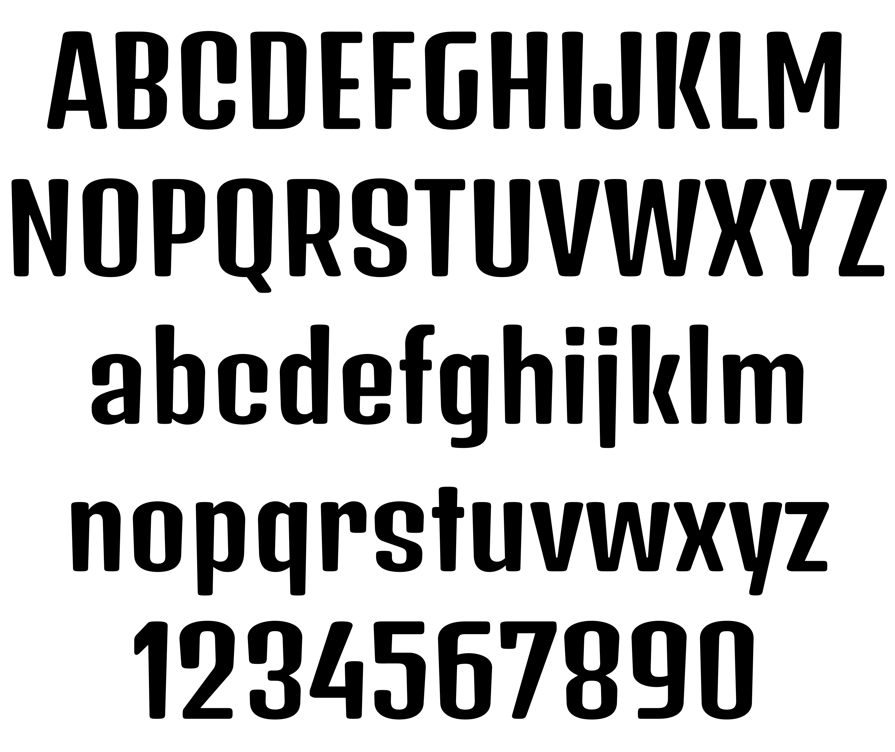
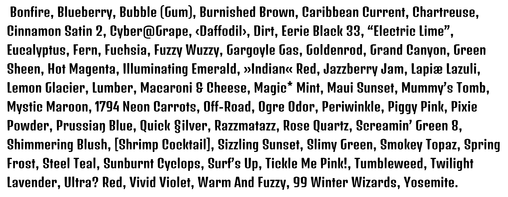

# Denk One

Denk is a medium contrast display sans serif. It was inspired by a hand painted German sign. Inder has been carefully adjusted to the restrictions of the screen. Despite having display characteristics Denk can be used in a wide range of sizes.

Denk One is a Unicode typeface family that supports languages that use the Latin script and its variants, and could be expanded even further with weights widths and in terms of Language support.

According to Hyperglot, DenkOne has base support for:

488 languages of Latin script:
------------------------------
Abidji, Abron, Abua, Acheron, Achinese, Acholi, Achuar-Shiwiar, Adamawa Fulfulde, Adangme, Adele, Afar, Afrikaans, Aghem, Agni, Aguaruna, Ahanta, Ahtna, Aja (Benin), Akebu, Akoose, Alekano, Aleut, Amahuaca, Amarakaeri, Amis, Anaang, Andaandi, Dongolawi, Angas, Anii, Anufo, Anuta, Ao Naga, Apinayé, Arabela, Aragonese, Arbëreshë Albanian, Arvanitika Albanian, Asháninka, Ashéninka Perené, Asturian, Asu (Tanzania), Atayal, Avatime, Awa-Cuaiquer, Awetí, Awing, Ayizo Gbe, Baatonum, Bafia, Bagirmi Fulfulde, Balante-Ganja, Balinese, Balkan Romani, Bambara, Baoulé, Bari, Basque, Bassari, Batak Dairi, Batak Karo, Batak Mandailing, Batak Simalungun, Batak Toba, Bemba (Zambia), Bena (Tanzania), Biali, Bikol, Bini, Bislama, Bissa, Boko (Benin), Bomu, Bora, Borana-Arsi-Guji Oromo, Borgu Fulfulde, Bosnian, Bouna Kulango, Breton, Buginese, Bushi, Candoshi-Shapra, Caquinte, Caribbean Hindustani, Cashibo-Cacataibo, Cashinahua, Catalan, Cebuano, Central Aymara, Central Kurdish, Central Nahuatl, Central-Eastern Niger Fulfulde, Cerma, Chachi, Chamorro, Chavacano, Chayahuita, Chiga, Chiltepec Chinantec, Chokwe, Chuukese, Cimbrian, Cofán, Congo Swahili, Cook Islands Māori, Cornish, Corsican, Creek, Crimean Tatar, Croatian, Czech, Dagbani, Danish, Dehu, Dendi (Benin), Dimli, Dinka, Duala, Dutch, Dyan, Dyula, Eastern Abnaki, Eastern Arrernte, Eastern Maninkakan, Eastern Oromo, Efik, Embu, English, Ese Ejja, Ewe, Falam Chin, Fanti, Farefare, Faroese, Fe'Fe', Fijian, Filipino, Finnish, Fon, Foodo, French, Friulian, Ga, Gagauz, Galician, Ganda, Garifuna, Ga’anda, Gen, German, Gheg Albanian, Gilbertese, Gonja, Gooniyandi, Gourmanchéma, Guadeloupean Creole French, Guinea Kpelle, Gusii, Gwichʼin, Haitian, Hakha Chin, Hani, Hausa, Hiligaynon, Ho-Chunk, Hopi, Huastec, Hungarian, Hän, Ibibio, Icelandic, Idoma, Igbo, Iloko, Inari Sami, Indonesian, Irish, Istro Romanian, Italian, Ixcatlán Mazatec, Jamaican Creole English, Japanese, Javanese, Jenaama Bozo, Jola-Fonyi, K'iche', Kabiyè, Kabuverdianu, Kabyle, Kaingang, Kako, Kala Lagaw Ya, Kalaallisut, Kalenjin, Kamba (Kenya), Kanuri, Kaonde, Kaqchikel, Karelian, Karo, Kasem, Kashubian, Kekchí, Kenzi, Mattokki, Khasi, Kikuyu, Kimbundu, Kinyarwanda, Kirmanjki, Kituba (DRC), Kom (Cameroon), Kongo, Konzo, Koonzime, Koyra Chiini Songhay, Koyraboro Senni Songhai, Krio, Kuanyama, Kusaal, Kven Finnish, Kwasio, Kölsch, Ladin, Ladino, Lama, Lamnso', Langi, Latgalian, Latin, Ligurian, Lingala, Lithuanian, Lobi, Lombard, Low German, Lower Sorbian, Lozi, Luba-Katanga, Luba-Lulua, Lukpa, Lule Sami, Luo (Kenya and Tanzania), Luxembourgish, Maasina Fulfulde, Macedo-Romanian, Madurese, Makhuwa, Makhuwa-Meetto, Makonde, Makwe, Malagasy, Malaysian, Malba Birifor, Maltese, Mamara Senoufo, Mandinka, Mandjak, Mankanya, Manx, Maore Comorian, Maori, Mapudungun, Marshallese, Masai, Masana, Matsés, Mauritian Creole, Medumba, Mende (Sierra Leone), Meriam Mir, Meru, Meta’, Metlatónoc Mixtec, Mezquital Otomi, Mi'kmaq, Minangkabau, Mirandese, Mizo, Moba, Mohawk, Montenegrin, Mossi, Munsee, Murrinh-Patha, Murui Huitoto, Muslim Tat, Mwani, Ménik, Mískito, Naga Pidgin, Navajo, Nawdm, Ndonga, Ndrulo, Neapolitan, Ngazidja Comorian, Ngiemboon, Nigerian Fulfulde, Niuean, Nobiin, Nomatsiguenga, Noon, North Azerbaijani, North Ndebele, Northeastern Dinka, Northern Bobo Madaré, Northern Dagara, Northern Kissi, Northern Kurdish, Northern Qiandong Miao, Northern Sami, Northern Uzbek, Norwegian, Nuer, Nyamwezi, Nyanja, Nyankole, Nyemba, Nzima, Occitan, Ojitlán Chinantec, Orma, Oroqen, Otuho, Palauan, Paluan, Pampanga, Papantla Totonac, Papiamento, Paraguayan Guaraní, Pedi, Picard, Pichis Ashéninka, Piemontese, Pijin, Pintupi-Luritja, Pipil, Pite Sami, Pohnpeian, Polish, Portuguese, Potawatomi, Pulaar, Pular, Purepecha, Páez, Quechua, Romanian, Romansh, Rotokas, Rundi, Rwa, Saafi-Saafi, Samburu, Samoan, Sango, Sangu (Tanzania), Saramaccan, Sardinian, Saxwe Gbe, Scottish Gaelic, Secoya, Sena, Serer, Seri, Seselwa Creole French, Shambala, Sharanahua, Shawnee, Shilluk, Shipibo-Conibo, Shona, Shuar, Sicilian, Silesian, Siona, Sissala, Skolt Sami, Slovak, Slovenian, Soga, Somali, Soninke, South Azerbaijani, South Ndebele, Southern Aymara, Southern Bobo Madaré, Southern Dagaare, Southern Nuni, Southern Qiandong Miao, Southern Sami, Southern Sotho, Spanish, Sranan Tongo, Standard Estonian, Standard Latvian, Standard Malay, Sundanese, Susu, Swahili, Swati, Swedish, Swiss German, Syenara Senoufo, Tagalog, Tahitian, Taita, Talysh, Tasawaq, Tedim Chin, Tem, Tetum, Tetun Dili, Ticuna, Tigon Mbembe, Timne, Tiv, Tiéyaxo Bozo, Toba, Tojolabal, Tok Pisin, Tokelau, Toma, Tonga (Tonga Islands), Tonga (Zambia), Tosk Albanian, Totontepec Mixe, Tsafiki, Tsakhur, Tsonga, Tswana, Tumbuka, Turkish, Turkmen, Tuvalu, Twi, Tzeltal, Tzotzil, Uab Meto, Umbundu, Ume Sami, Upper Guinea Crioulo, Upper Sorbian, Urarina, Venda, Venetian, Veps, Vietnamese, Vlax Romani, Võro, Waama, Waci Gbe, Walloon, Walser, Wamey, Wangaaybuwan-Ngiyambaa, Waorani, Waray (Philippines), Warlpiri, Wasa, Wayuu, Welsh, West Central Oromo, West-Central Limba, Western Abnaki, Western Frisian, Western Niger Fulfulde, Wik-Mungkan, Winyé, Wiradjuri, Wolof, Xavánte, Xhosa, Xwela Gbe, Yagua, Yanesha', Yangben, Yanomamö, Yao, Yapese, Yindjibarndi, Yom, Yoruba, Yucateco, Zapotec, Zarma, Zulu, Zuni, Záparo

## Authors

N: Irina Smirnova
E: irina.v.sm@gmail.com
D: Designer

N: Eben Sorkin
E: sorkineben@gmail.com
W: www.sorkintype.com
D: Designer, Mastering

## Building

Fonts are built automatically by GitHub Actions - take a look in the "Actions" tab for the latest build.

If you want to build fonts manually on your own computer:

* `make build` will produce font files.
* `make test` will run [FontBakery](https://github.com/googlefonts/fontbakery)'s quality assurance tests.
* `make proof` will generate HTML proof files.

## Changelog

When you update your font (new version or new release), please report all notable changes here, with a date.
[Font Versioning](https://github.com/googlefonts/gf-docs/tree/main/Spec#font-versioning) is based on semver. 

**Date + Version**

## License

This Font Software is licensed under the SIL Open Font License, Version 1.1.
This license is available with a FAQ at
https://scripts.sil.org/OFL

## Repository Layout

This font repository structure is inspired by [Unified Font Repository v0.3](https://github.com/unified-font-repository/Unified-Font-Repository), modified for the Google Fonts workflow.
